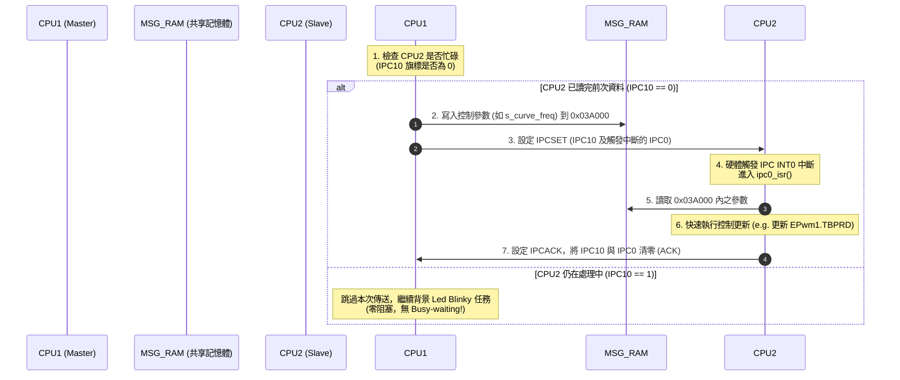

# TMS320F28388D 雙核心 IPC 非阻塞通訊與中斷握手學習筆記

本篇筆記詳細剖析 `empty_agy` 專案中，如何基於 TI C28x 暫存器規範實作**「非阻塞式 IPC 握手 (Handshake) 通訊」**與中斷路由機制。這是在 100kHz 高頻電力電子控制系統中，避免 CPU 阻塞死等（Busy-waiting）的核心基礎。

---

## 一、 IPC 非阻塞握手時序流程

在非阻塞架構中，CPU1（傳送端）不會卡在迴圈中死等 CPU2 處理完畢，而是採取「有空才傳，沒空就跳過」的機制：



---

## 二、 CPU1 傳送端：非阻塞寫入與觸發

位於專案的 [led_ex2_blinky_sysconfig_cpu1.c](file:///d:/GITHUB/28388D_176pin_25M/empty_agy/sysconfig_cpu1/led_ex2_blinky_sysconfig_cpu1.c) 背景主迴圈中：

```c
// 1. 檢查 CPU2 是否已經處理完上一次的命令 (判斷 IPC10 旗標是否被 CPU2 清除為 0)
if(Cpu1toCpu2IpcRegs.CPU1TOCPU2IPCFLG.bit.IPC10 == 0)
{
    // 2. 寫入控制參數至兩核共享的 Message RAM (CPU1_TO_CPU2_MSG_RAM, 起始位址 0x03A000)
    *((volatile uint32_t *)0x03A000) = s_curve_freq;

    s_curve_freq += 10;
    if(s_curve_freq > 5000) s_curve_freq = 1000;

    // 3. 觸發 IPC 訊號：
    //    - IPC10: 當作通訊協議中的 Command 旗標，告訴 CPU2 有新資料。
    //    - IPC0: 硬體連接到 CPU2 中斷系統的 INT0，負責把 CPU2 叫進中斷服務常式 (ISR)。
    EALLOW;
    Cpu1toCpu2IpcRegs.CPU1TOCPU2IPCSET.all = (1UL << 10) | (1UL << 0);
    EDIS;
}
```

### 暫存器底層原理解析
*   **`CPU1TOCPU2IPCFLG` (Flag 暫存器)**：這是一個唯讀狀態暫存器。若對應的 bit 為 `1`，代表該 IPC 旗標目前處於啟動（已設置但未被 ACK）狀態。
*   **`CPU1TOCPU2IPCSET` (Set 暫存器)**：我們不能直接寫入 `IPCFLG`，必須寫入 `IPCSET` 來將特定旗標置 `1`。
*   **非阻塞關鍵**：如果 `IPC10` 仍為 `1`，代表 CPU2 還在忙，CPU1 會**直接跳過整個 `if` 區塊**，不會卡在 `while` 迴圈裡死等。這保證了 CPU1 背景程式 Blinky 與其他控制環路的即時性。

---

## 三、 中斷路由：從 IPC0 到 `ipc0_isr`

當 CPU1 寫入 `CPU1TOCPU2IPCSET.bit.IPC0 = 1` 時，晶片內部的硬體中斷控制器 (PIE) 會將此信號導引給 CPU2：
1.  **PIE Group 1, Channel 13** 對應的是 **IPC_INT0**。
2.  在 CPU2 初始化中，我們透過 driverlib 註冊了該中斷：
    ```c
    // 註冊中斷向量表，指定觸發 IPC_INT0 時，CPU2 跳轉至 ipc0_isr 執行
    IPC_registerInterrupt(IPC_CPU2_L_CPU1_R, IPC_INT0, ipc0_isr);
    ```

---

## 四、 CPU2 接收端：中斷處理與確認 (ACK)

當 CPU2 偵測到中斷，它會暫停背景任務，立即跳入 [led_ex2_blinky_sysconfig_cpu2.c](file:///d:/GITHUB/28388D_176pin_25M/empty_agy/sysconfig_cpu2/led_ex2_blinky_sysconfig_cpu2.c) 中的中斷服務常式：

```c
__interrupt void ipc0_isr(void)
{
    // 1. 驗證 CPU1 是否確實設置了 IPC10 旗標 (確認這是一次合法的資料更新命令)
    if(Cpu2toCpu1IpcRegs.CPU1TOCPU2IPCSTS.bit.IPC10 == 1)
    {
        // 2. 從 Message RAM 讀出最新的頻率參數
        uint32_t freq_val = *((volatile uint32_t *)0x03A000);

        // 3. 清除/回報 ACK：
        //    寫入 CPU2TOCPU1IPCACK 暫存器，將 IPC10 與 IPC0 旗標清零。
        //    這會使得 CPU1 的 CPU1TOCPU2IPCFLG 暫存器對應的位元變回 0，通知 CPU1「握手完成，可傳下一次」。
        EALLOW;
        Cpu2toCpu1IpcRegs.CPU2TOCPU1IPCACK.all = (1UL << 10) | (1UL << 0);
        EDIS;

        // 4. 將頻率套用到實際的 PWM 週邊暫存器，調整 PWM 週期
        EPwm1Regs.TBPRD = (uint16_t)freq_val;
    }

    // 5. 告知 PIE 模組已完成此組中斷處理，允許接收下一次的中斷
    Interrupt_clearACKGroup(INTERRUPT_ACK_GROUP1);
}
```

### 暫存器底層原理解析
*   **`CPU1TOCPU2IPCSTS` (Status 暫存器)**：在 CPU2 端，它讀取 `IPCSTS` 來確認 CPU1 丟過來的是哪些旗標。
*   **`CPU2TOCPU1IPCACK` (Acknowledge 暫存器)**：CPU2 不能直接去修改 `IPCSTS`，它必須寫入 `IPCACK` 暫存器。寫入對應的 bit 就會自動清除該 IPC 旗標，進而解除 CPU1 端的 Flag 鎖定。

---

## 五、 數位電源大師思維

在這個雙核通訊框架中，我們展現了工業級控制系統的兩個核心法則：
1.  **控制數據與中斷分離**：`IPC10` 用於控制訊號確認（數據），`IPC0` 用於觸發執行（中斷），避免了單一 Flag 容易造成的資料覆蓋 (Race Condition)。
2.  **硬體解耦**：Message RAM (位址 `0x03A000`) 是兩顆核心在硬體上都能存取的記憶體，讀寫速度極快且不需要經過匯流排仲裁等待。
