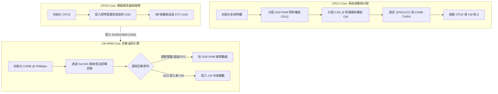

# 🚗 car_uds_canfd 專案教學與架構解析

本專案實作了基於 **TMS320F28388D 異質三核心（CPU1、CPU2、CM）** 的車用診斷系統，並針對 **研旭 YXDSP-F28388D 一體板** 的硬體限制進行了適配（方案 B），採用經典 CANB（DCAN）通訊，並在 CM 核心上完整實作了符合 **ISO 15765-2 (DoCAN)** 規範的 8 字節分包傳輸層，以及 **ISO 14229 (UDS)** 診斷服務。

---

## 1. 系統架構與多核心分工 (System Architecture)

專案充分發揮了 F28388D 的多核心優勢，透過**共享記憶體 (GS0 RAM)** 與**周邊擁有權分配**實現高效率的解耦合作：



### 📂 核心程式碼對應：
*   **分配與引導**：[led_ex2_blinky_sysconfig_cpu1.c](sysconfig_cpu1/led_ex2_blinky_sysconfig_cpu1.c) 負責系統主控。
*   **感測與故障狀態機**：[led_ex2_blinky_sysconfig_cpu2.c](sysconfig_cpu2/led_ex2_blinky_sysconfig_cpu2.c) 負責模擬車載電池包的物理狀態。
*   **診斷與通訊協議棧**：[led_ex2_blinky_sysconfig_cm.c](sysconfig_cm/led_ex2_blinky_sysconfig_cm.c) 負責 ARM 核心上的通訊排程。
*   **資料結構定義**：[car_uds_shared.h](car_uds_shared.h) 定義雙核共享變數，並強制進行 32-bit 對齊以相容 C28x 與 ARM。

---

## 2. 經典 CANB 硬體初始化 (Option B Peripheral Config)

研旭一體板的板載收發器（SN65HVD230 或同等晶片）硬體接腳連接於 `GPIO12` 與 `GPIO13`，對應為 `CAN_B` 周邊。

### CPU1 端的硬體腳位與擁有權配置：
```c
// 1. 將 GS0 RAM 的控制權分配給 CPU2，以便 CPU2 能夠寫入即時資料
MemCfg_setGSRAMControllerSel(MEMCFG_SECT_GS0, MEMCFG_GSRAMCONTROLLER_CPU2);

// 2. 將 CAN_B 的周邊擁有權分配給 CM 核心 (1U 代表 CM)
SysCtl_allocateSharedPeripheral(SYSCTL_PALLOCATE_CAN_B, 1U);

// 3. 設定 GPIO12 為 CANB 發送、GPIO13 為接收
GPIO_setPinConfig(GPIO_12_CANB_TX);
GPIO_setPinConfig(GPIO_13_CANB_RX);
```

### CM 端的 CANB 初始化 (@500kbps 波特率)：
```c
void ConfigureCAN(void)
{
    // 啟用 CANB 外設時鐘
    SysCtl_enablePeripheral(SYSCTL_PERIPH_CLK_CAN_B);
    
    // 初始化 CANB 模組
    CAN_initModule(CANB_BASE);
    
    // 設定波特率：使用 CM 核心頻率 (125MHz)，設定為 500kbps
    CAN_setBitRate(CANB_BASE, CM_CLK_FREQ, 500000, 20);
    
    // 設定 Mailbox 1 作為傳送 (TX)，Mailbox 2 作為接收 (RX)
    CAN_setupMessageObject(CANB_BASE, 1, 0x7E8, CAN_MSG_FRAME_STD, CAN_MSG_OBJ_TYPE_TX, 0, CAN_MSG_OBJ_NO_FLAGS, 8);
    CAN_setupMessageObject(CANB_BASE, 2, 0x7E0, CAN_MSG_FRAME_STD, CAN_MSG_OBJ_TYPE_RX, 0, CAN_MSG_OBJ_NO_FLAGS, 8);
    
    // 啟動 CAN 模組
    CAN_startModule(CANB_BASE);
}
```

---

## 3. ISO 15765-2 DoCAN 傳輸層實作

因為經典 CAN 每影格的 payload 上限為 **8 字節**，而 UDS 的診斷回應（如讀取 17 字节的 VIN 碼，加上 SID 與 DID 總共需要 21 字節的響應長度）會超出限制，因此必須使用 DoCAN 進行分包與重組。

### 影格類型 (PCI 欄位定義)：
1.  **Single Frame (SF)**：小於等於 7 字節的數據（首字節高 4 位為 `0x0`）。
2.  **First Frame (FF)**：多影格傳輸的首影格，包含總長度與前 6 字節數據（首字節高 4 位為 `0x1`）。
3.  **Flow Control (FC)**：接收端發給發送端，用來控制發送速率與區塊大小（首字節高 4 位為 `0x3`）。
4.  **Consecutive Frame (CF)**：連續影格，攜帶剩餘數據（首字節高 4 位為 `0x2`，後 4 位為序號 SN）。

### 21 字節 VIN 回應的傳輸過程 (以本專案實作為例)：
```text
[Tester 請求讀取 VIN]
Client -> Server (SF): 03 22 F1 90 AA AA AA AA
                       (長度3, RDBI服務 0x22, DID 0xF190)

[Server 回應 VIN - 總長 21 字節]
Server -> Client (FF): 10 15 62 F1 90 54 49 5F
                       (多幀標誌 0x1, 總長度 21 = 0x015, UDS回應 0x62 F1 90, 數據: 'T','I','_')
                       
Client -> Server (FC): 30 00 00 AA AA AA AA AA
                       (流控影格: 繼續發送 FS=0, 區塊大小 BS=0, 間隔時間 STmin=0)
                       
Server -> Client (CF): 21 46 32 38 33 38 38 44
                       (連續幀 SN=1, 數據: 'F','2','8','3','8','8','D')
                       
Server -> Client (CF): 22 5F 43 41 52 5F 30 31
                       (連續幀 SN=2, 數據: '_','C','A','R','_','0','1')
```

---

## 4. ISO 14229 UDS 診斷服務實作

專案支援以下五大核心車規診斷服務，並進行了**安全防禦 (Security)** 與**條件限制 (Session Lock)** 的實作：

| 服務 ID (SID) | 服務名稱 | 說明與安全限制 |
| :--- | :--- | :--- |
| **`0x10`** | Diagnostic Session Control (診斷會話控制) | 支援預設會話 (`0x01`)、編程會話 (`0x02`)、擴展會話 (`0x03`)。切換會話時會自動重新鎖定安全狀態。 |
| **`0x22`** | Read Data By Identifier (讀取資料) | 支援讀取 VIN (`0xF190`)，以及讀取 CPU2 傳來的電芯電壓與溫度 (`0x0100`)。 |
| **`0x2E`** | Write Data By Identifier (寫入資料) | 支援寫入新 VIN (`0xF190`)。**安全限制：必須處於擴展會話且安全狀態為已解鎖 (Unlocked)**，否則回報 NRC `0x22` 或 `0x33`。 |
| **`0x27`** | Security Access (安全存取) | 採用 **FNV-1a 32-bit Hash 演算法**。客戶端發送 `0x27 01` 索取隨機種子，計算 Hash 密鑰後以 `0x27 02` 發送回伺服器比對解鎖。 |
| **`0x19`** | Read DTC Information (讀取故障碼) | 當 CPU2 偵測到過溫（溫度 $\ge 65^\circ\text{C}$）並將 `active_fault_code` 設為 `0x02` 時，CM 會回報車規級過溫故障碼 `0x9A0115`，且狀態為 ACTIVE。 |

---

## 5. 本地自我測試模擬器 (`RunUDSSimulation`)

為了確保整個通訊協議棧與 UDS 狀態機工作正常，CM 核心中整合了一個**自我測試模擬器**。
當晶片啟動後，它會自動模擬發送端（Client/Tester）與接收端（Server/ECU）的交互：

```c
void RunUDSSimulation(void)
{
    sim_in_progress = 1;

    // [Test 1] 在 Default 模式下讀取 VIN - 應該成功
    // [Test 2] 在 Default 模式下寫入 VIN - 應被拒絕 (回報 NRC 0x22)
    // [Test 3] 切換至 Extended 診斷會話 (0x03) - 應該成功
    // [Test 4] 在 Extended 模式下，鎖定狀態下寫入 VIN - 應被拒絕 (回報 NRC 0x33)
    // [Test 5] 安全存取：向 Server 索取 Seed (0x01) - 應該成功
    // [Test 6] 安全存取：發送計算好的 Key (0x02) 進行解鎖 - 應該成功
    // [Test 7] 解鎖後寫入新 VIN - 應該成功
    // [Test 8] 讀取故障碼 (DTC) - 當 CPU2 的過溫代碼 active_fault_code == 0x02 時，應能正確讀出 0x9A0115。

    sim_in_progress = 0;
    uds_simulation_success = 1; // 所有測試都通過後，此標誌位會被設為 1
}
```
如果您使用 CCS 進行 Debug，可以將 `uds_simulation_success` 加入 **Expressions** 視窗，如果其值為 `1`，即代表整個 UDS 與 DoCAN 分包重組自我檢測無誤。

---

## 6. 如何編譯與部署專案 (How to Build & Run)

> [!IMPORTANT]
> **CCS 導入注意事項**：
> 當您將本專案導入 Code Composer Studio (CCS) 時，**切勿**勾選 "Copy projects into workspace" (將專案複製到工作空間)。因為專案內的編譯標頭檔是以相對路徑指向同級的 `car_uds_shared.h`，複製專案會破壞相對路徑導致編譯失敗。

### 編譯步驟：
1.  開啟 CCS，導入位於 `car_uds_canfd` 下的三個專案：
    *   `sysconfig_cpu1`
    *   `sysconfig_cpu2`
    *   `sysconfig_cm`
2.  分別在三個專案上按右鍵，選擇 **Build Project**（預設為 RAM 目標）。
3.  編譯完成後，會生成對應的 `.out` 檔案：
    *   CPU1: `sysconfig_cpu1.out`
    *   CPU2: `sysconfig_cpu2.out`
    *   CM: `sysconfig_cm.out`
4.  連線模擬器（如 XDS100v2/XDS200），依序載入這三個核心的編譯結果，並執行（Resume），即可在 Watch 視窗觀察 UDS 變數的動態變化。
